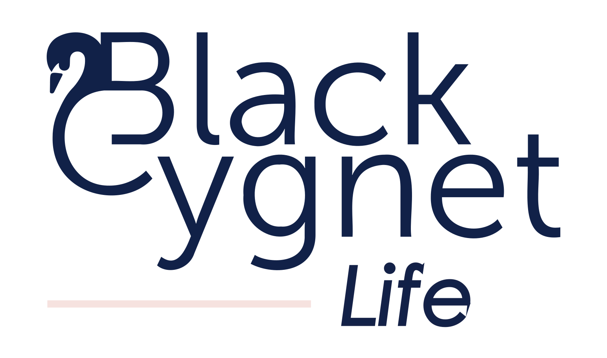

# Black Cygnet Life Brand Assets

Centralised brand assets for **Black Cygnet Life**, a life insurance brand within Black Cygnet Group. Served globally via jsDelivr CDN — no install step required.

## About Black Cygnet Life

Black Cygnet Life is positioned as The Visionary Rebel — bold, insightful, and committed to creating the extraordinary. The brand challenges the conventions of traditional insurance, seeking opportunity where others see limits. Its voice is curious, courageous, and direct.

## Using these assets in an app

Every file in this repo is automatically available on jsDelivr. The URL pattern is:

```
https://cdn.jsdelivr.net/gh/Black-Cygnet-Group/black-cygnet-life-brand@<tag>/<path-in-repo>
```

### Logo in an HTML page or email

```html

```

### Logo in a React component

```ts
const BCL_LOGO = 'https://cdn.jsdelivr.net/gh/Black-Cygnet-Group/black-cygnet-life-brand@v0.1.0/logo/primary/bcl-logo-primary-full-colour.svg';

export const Header = () => ;
```

### Colour tokens via CSS variables

```html
<link
  rel="stylesheet"
  href="https://cdn.jsdelivr.net/gh/Black-Cygnet-Group/black-cygnet-life-brand@v0.1.0/colour/palette.css"
/>
```

Then use `var(--bcl-ocean)`, `var(--bcl-misty-rose)`, etc.

### Colour tokens as JSON (any framework)

```ts
import palette from 'https://cdn.jsdelivr.net/gh/Black-Cygnet-Group/black-cygnet-life-brand@v0.1.0/colour/palette.json'
  assert { type: 'json' };
```

Or copy the values from [`colour/palette.json`](./colour/palette.json) into your app's theme directly — both are valid.

## Versioning — how to pin

- **Production apps: always pin to a tag** (e.g. `@v0.1.0`). Your app will not break if we update an asset.
- **Development or always-latest: use `@main`** (e.g. `@main/logo/...`). You'll get updates immediately, including breaking ones.
- Never mix the two in the same app.

## Releases

See [CHANGELOG.md](./CHANGELOG.md) for what changed in each version.

- **Major** (e.g. v2.0.0): an asset was removed, renamed, or changed in a way that breaks existing apps.
- **Minor** (e.g. v1.1.0): a new asset was added.
- **Patch** (e.g. v1.0.1): an asset was fixed (e.g. a cleaner SVG export) but looks identical.

## Brand identity at a glance

### Colour palette

The canonical palette. See [`colour/palette.json`](./colour/palette.json) for the full definition with RGB, CMYK, and usage rules.

<table>
  <thead>
    <tr><th>&nbsp;</th><th>Name</th><th>Hex</th><th>Usage</th></tr>
  </thead>
  <tbody>
    <tr>
      <td bgcolor="#001f49" width="80">&nbsp;</td>
      <td><strong>Ocean</strong></td>
      <td><code>#001f49</code></td>
      <td>Primary — body text, primary dark background. Never use plain black for body.</td>
    </tr>
    <tr>
      <td bgcolor="#f6e2e0" width="80">&nbsp;</td>
      <td><strong>Misty Rose</strong></td>
      <td><code>#f6e2e0</code></td>
      <td>Primary background. Body text only when on an Ocean background.</td>
    </tr>
    <tr>
      <td bgcolor="#fe3725" width="80">&nbsp;</td>
      <td><strong>Candy</strong></td>
      <td><code>#fe3725</code></td>
      <td>Secondary accent / error. Never as a background or body text.</td>
    </tr>
    <tr>
      <td bgcolor="#439bbb" width="80">&nbsp;</td>
      <td><strong>Sky</strong></td>
      <td><code>#439bbb</code></td>
      <td>Secondary background / success. Pairs with Ocean or White for text.</td>
    </tr>
    <tr>
      <td bgcolor="#ffffff" width="80">&nbsp;</td>
      <td><strong>White</strong></td>
      <td><code>#ffffff</code></td>
      <td>Primary background. Reversed text on Ocean backgrounds.</td>
    </tr>
  </tbody>
</table>

**Usage ratio across collateral:** Ocean 50% / Misty Rose 30% / Candy 10% / Sky 10%.

*Note: the BCL palette does not include Maroon, which is part of the Keveko palette. Do not use Maroon in BCL collateral.*

### Logo

The primary logo is the Black Cygnet Life wordmark paired with its symbol mark — the "B" and "C" of Black Cygnet intertwined to form a swan.



**Primary logo variants (4 colour treatments, SVG + PNG):**

- `full-colour` — the default multi-colour lockup
- `mono-navy` — Ocean single-tone
- `mono-misty-rose` — Misty Rose single-tone
- `mono-white` — for use on dark backgrounds

*There is no `mono-black` variant at v0.1.0 — see [`OPEN-QUESTIONS.md`](./OPEN-QUESTIONS.md) item 2.*

**Mark (symbol) variants (6 colour treatments, SVG + PNG):**

The standalone swan symbol is available as `mono-black`, `mono-white`, `mono-navy`, `mono-sky`, `mono-misty-rose`, `mono-candy`. See [`logo/mark/`](./logo/mark/).

**Usage rules (from the brand guide):**

- Clear space: maintain at least half the symbol's diameter around the logo.
- The swan can face either direction — no restriction.
- Be bold and creative with mark usage, but avoid stretching, re-colouring outside the palette, or placing on busy photographic backgrounds.

### Parent-brand (Black Cygnet Group) swan mark

The BCG parent-brand swan is available in this repo under [`parent-brand/mark/`](./parent-brand/mark/) with the `bcg-` filename prefix (e.g. `bcg-mark-primary-mono-navy.svg`). It's included here because BCL collateral frequently references the parent brand. When a dedicated BCG brand repo is created, these assets will move there — see [`OPEN-QUESTIONS.md`](./OPEN-QUESTIONS.md) item 6.

### Typography

| Family | Role | Weights | Source |
|---|---|---|---|
| Museo Sans | Primary — all brand collateral | 300, 400, 500, 700, 900 | Adobe Fonts / MyFonts (commercial) |
| Century Gothic | Web fallback | 400, 700 | System / widely licensed |
| Feeling Passionate | Accent — internal marketing use only, sparingly | 400 | Source & licence to be confirmed — see [`OPEN-QUESTIONS.md`](./OPEN-QUESTIONS.md) |

Body text is always Ocean `#001f49`, never plain black. See [`typography/fonts.md`](./typography/fonts.md) for sourcing details.

### Full brand guidelines

The canonical 33-page brand guide is committed in [`guidelines/black-cygnet-life-brand-guide.pdf`](./guidelines/black-cygnet-life-brand-guide.pdf). It covers brand manifesto, personality archetypes, logo usage, colour, typography, patterns, photography treatment, and application examples.

**Note:** the PDF is ~26 MB, which exceeds jsDelivr's 20 MB per-file limit, so it is **not available via the jsDelivr CDN**. View it on GitHub at the link above, or download directly via:

```
https://github.com/Black-Cygnet-Group/black-cygnet-life-brand/raw/v0.1.1/guidelines/black-cygnet-life-brand-guide.pdf
```

A compressed version is being requested — see [`OPEN-QUESTIONS.md`](./OPEN-QUESTIONS.md) item 7.

## Related repositories

- [Keveko brand assets](https://github.com/Black-Cygnet-Group/keveko-brand) — the other Black Cygnet subsidiary brand.

## Open questions

Some brand items are still awaiting input from the brand and marketing teams — see [OPEN-QUESTIONS.md](./OPEN-QUESTIONS.md).

## Maintenance

See [HANDOVER.md](./HANDOVER.md) for maintainer documentation.

## Requesting changes

Open an issue in this repo, or contact the maintainers listed in [HANDOVER.md](./HANDOVER.md).
